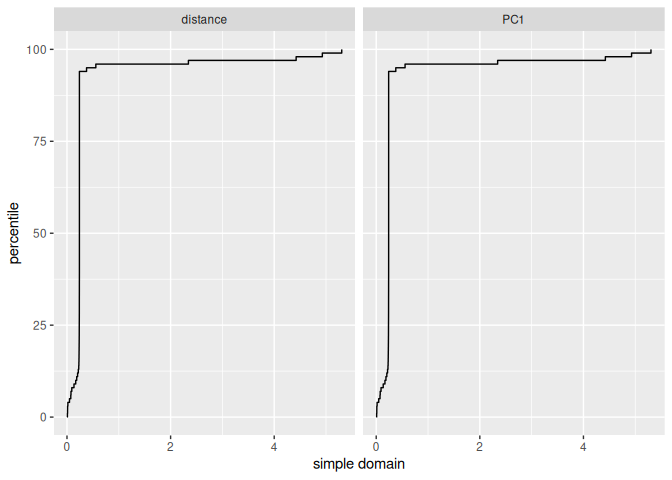

<!-- README.md is generated from README.Rmd. Please edit that file -->

# viraldomain

<!-- badges: start -->
<!-- badges: end -->

The goal of viraldomain is to provide methods for assessing the
applicability domain of models that predict viral load and CD4 (Cluster
of Differentiation 4) lymphocyte counts. These methods help determine
the extent of extrapolation when making predictions.

## Installation

You can install the development version of viraldomain from GitHub with:

``` r
# install.packages("devtools")
devtools::install_github("juanv66x/viraldomain")
#> 
#> ── R CMD build ─────────────────────────────────────────────────────────────────
#>      checking for file ‘/tmp/Rtmp6medQX/remotesa89540251f8f/juanv66x-viraldomain-1983b42/DESCRIPTION’ ...  ✔  checking for file ‘/tmp/Rtmp6medQX/remotesa89540251f8f/juanv66x-viraldomain-1983b42/DESCRIPTION’ (363ms)
#>   ─  preparing ‘viraldomain’:
#> ✔  checking DESCRIPTION meta-information
#>   ─  checking for LF line-endings in source and make files and shell scripts
#>   ─  checking for empty or unneeded directories
#>   ─  building ‘viraldomain_0.0.0.9000.tar.gz’
#>      
#> 
```

## Data

### Predictive Modeling Data for Viral Load and CD4 Lymphocyte Counts

This data set serves as input for predictive modeling tasks related to
HIV research. It contains numeric measurements of CD4 lymphocyte counts
(cd) and viral load (vl) at three different time points: 2019, 2021, and
2022. These measurements are crucial indicators of HIV disease
progression.

``` r
library(viraldomain)

data(viral)
print(head(viral))
#>    cd_2019     vl_2019  cd_2021    vl_2021  cd_2022      vl_2022
#> 1 824.5332    38.56798 991.7403   82.54730 699.5054     4.076213
#> 2 168.7046 11389.97420 274.4726 1671.39342 126.1513    14.921826
#> 3 342.5670 38960.42871 330.9015 5120.02580 127.0883 53268.898678
#> 4 423.1296    41.16719 454.1496   70.85965 546.0022    -7.202574
#> 5 441.1572    74.67582 478.8419  281.52784 547.4582    44.738029
#> 6 506.6313  4095.79251 553.0661 3077.96262 547.5480  1895.702386
```

### Seropositive Data for Applicability Domain Testing

This data set is designed for testing the applicability domain of
methods related to HIV research. It provides a tibble with 53 rows and 2
columns containing numeric measurements of CD4 lymphocyte counts
(cd_2022) and viral load (vl_2022) for seropositive individuals in 2022.

``` r
data(sero)
print(head(sero))
#>    cd_2022     vl_2022
#> 1 548.9531   19.975988
#> 2 160.1478   92.854885
#> 3 694.0009  -15.890951
#> 4 515.9214  -15.630209
#> 5 152.9998   -1.104756
#> 6 382.8012 3105.038849
```

## Functions

### knn_domain_score

This function fits a K-Nearest Neighbor (KNN) model to the provided data
and computes a domain applicability score based on PCA distances.

``` r
# Example usage of knn_domain_score
domain_scores <- knn_domain_score(
  featured = "cd_2022",
  train_data = viral |> dplyr::select(cd_2022, vl_2022),
  knn_hyperparameters = list(neighbors = 5, weight_func = "optimal", dist_power = 0.33),
  test_data = sero,
  threshold_value = 0.99
)
print(domain_scores)
#> # A tibble: 53 × 3
#>    .pred distance distance_pctl
#>    <dbl>    <dbl>         <dbl>
#>  1  591.    0.438         20.3 
#>  2  332.    1.35          70.7 
#>  3  330.    1.02          60.7 
#>  4  354.    0.332          3.60
#>  5  467.    1.38          74.9 
#>  6  350.    0.425          7.57
#>  7  528.    1.11          66.5 
#>  8  336.    0.346          3.98
#>  9  528.    0.568         24.5 
#> 10  332.    0.664         38.0 
#> # ℹ 43 more rows
```

### simple_domain_plot

This function generates a domain plot for a simple model based on PCA
distances of the provided data.

``` r
# Example usage of simple_domain_plot
simple_domain_plot(
  featured_col = "cd_2022",
  train_data = viral |> dplyr::select(cd_2022, vl_2022),
  test_data = sero,
  treshold_value = 0.99
)
```


